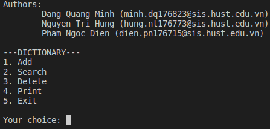

# Mini Project 1
## Team Members
- Minh Dang Quang (minh.dq176823@sis.hust.edu.vn) (leader)
- Hung Nguyen Tri (hung.nt176773@sis.hust.edu.vn)
- Dien Pham Ngoc (dien.pn176715@sis.hust.edu.vn)

### Assigned Tasks
- **Add new word**: Minh
- **Search** (with tab completion and word suggestion): Minh
- **Delete**: Minh
- **Print**: Minh, Hung
- **Update** (ask before overwrite existed word): Hung
- **Time benchmark**: Hung
- **Clear screen**: Dien
- **Beautify CLI**: Dien, Hung

## Installation and Usage
### Requirements
This program can only be compiled on Linux environments or Windows 10 Subsystems.

#### Install NCurses
This library is used for tab completion in searching.

Install:
```
sudo apt-get install libncurses5-dev libncursesw5-dev
```

### Compile
```
gcc main.c -lncurses -ltinfo bt-5.0.0/lib/libbt.a -o main
```

### Use
When the program (`main`) run for the first time, It will read data from `benchmark.txt` file and generate `dictionary.db` file.

Remove `dictionary.db` will make the program to read `benchmark.txt` again.

Start screen:


#### Search
- Press tab to complete the word. 
- Press double tab to show the suggested words.

**Note**: some functional keys don't behave as usual (del, up, down, left, right, shift,...). You should only use `backspace` to delete characters.

Example: (data loaded from `benchmark_small.txt`)
```
Search: tes1t
<No suggestion>
```

```
Search: test.txt
>>> test1.txt  test2.txt
```

### Benchmark
1. Remove `dictionary.db`.
2. Rename the desired data file to `benchmark.txt`. We have included some data files for benchmark: 
    - `benchmark_1m.txt`: contains 1 millions of English words and random generated words.
    - `benchmark_small.txt`: represents a list of files in a directory.
    - `benchmark_en.txt`: contains ~100k English words.
3. Re-run the program.
