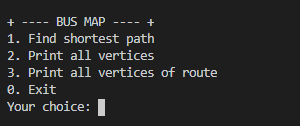

# Mini Project 2
## Team Members
- Minh Dang Quang (minh.dq176823@sis.hust.edu.vn) (leader)
- Hung Nguyen Tri (hung.nt176773@sis.hust.edu.vn)
- Dien Pham Ngoc (dien.pn176715@sis.hust.edu.vn)

## Assigned Tasks
- **Implement weighted graph and build some neccessary API**: Minh
- **Preprocess data**: Minh
- **Read data from file**: Minh
- **Implement finding shortest path algorithm (Dijkstra's algorithm)**: Hung
- **Write a function to get bus routes based on the shortest path**: Dien

## Installation and Usage
### Requirements
(Optional) This project will requires Python 3 for preprocessing data.

```
pip3 install Unidecode
```

#### Preprocess data
```
python3 preprocess_bus_data.py
```

### Compile
```
gcc -o main main.c libfdr/libfdr.a
```

### Usage

**Start screen**:



**Option 1**: Input 2 stations A and B, the program will print out the shortest path from A to B and a list of bus routes based on that.

**Option 2**: Print out all the vertices. There are currently 267 vertices in our data.

**Option 3**: Input the bus route, the program will print out all vertices that settle on that route.